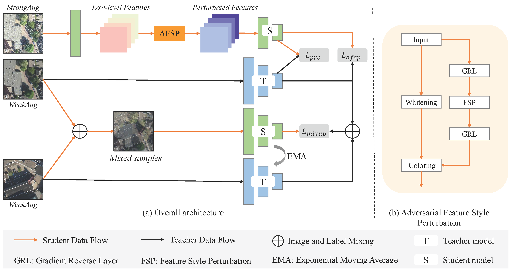
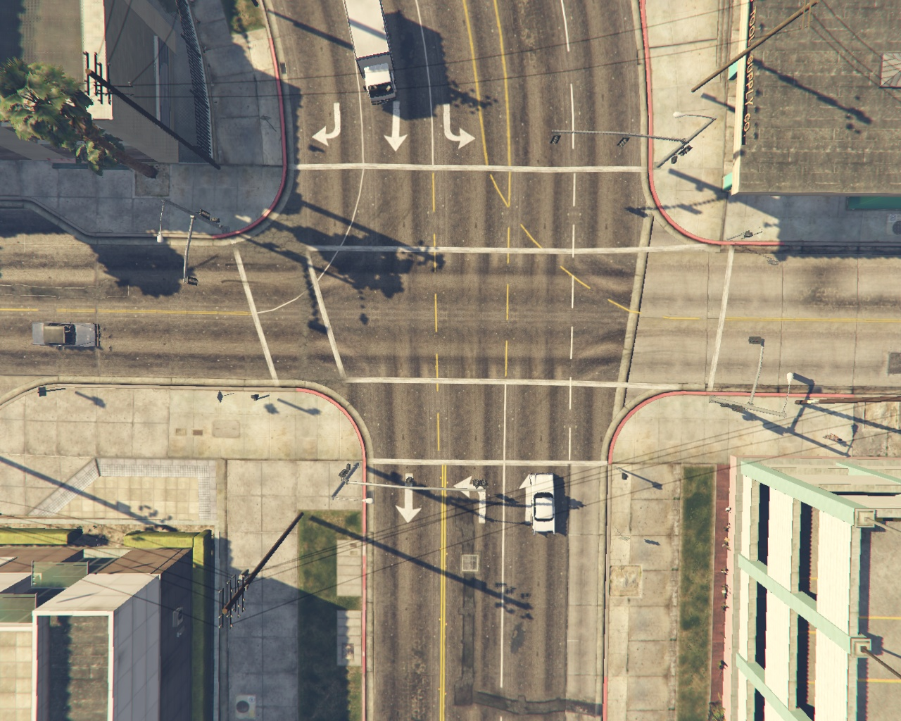
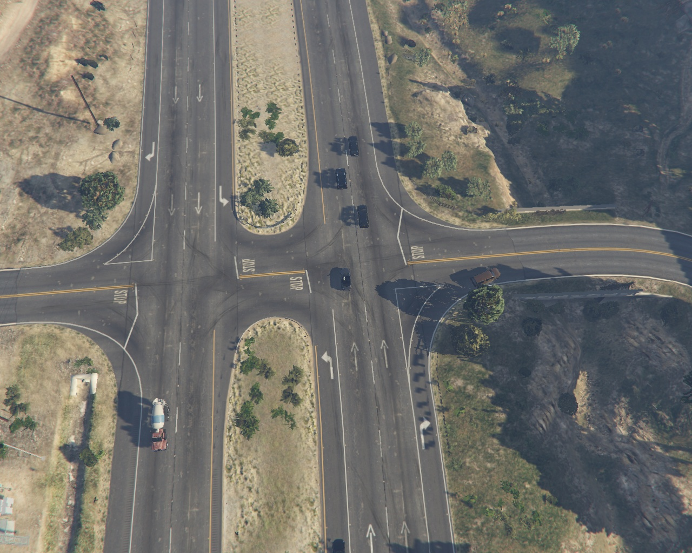
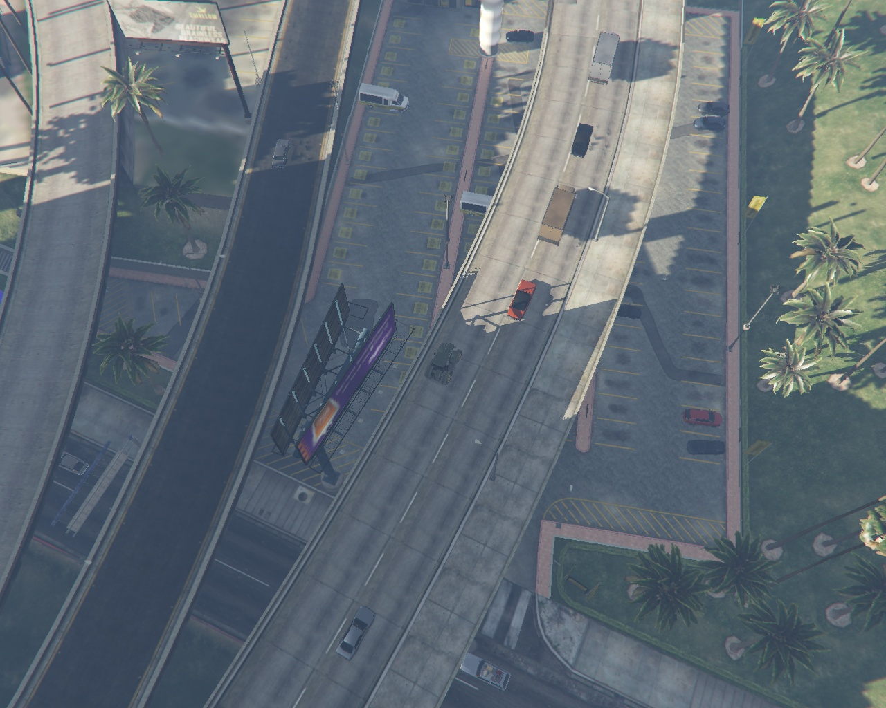

# 1. Multi-level Domain Perturbation for Source-free Object Detection in Remote Sensing Images
Our SFOD code [AFSP](https://github.com/weix-liu/AFSP.git) are available.
 

 

## Citation
This work is submitted to GSIS: 
Liu W, Liu J, Su X, Nie H, Luo B. Multi-level Domain Perturbation for Source-free Object Detection in Remote Sensing Images. Geo-spatial Information Science, 2024. 
 
The arXiv preprint version: 
@article{liu2024source, 
  title={Source-free Domain Adaptive Object Detection in Remote Sensing Images}, 
  author={Liu, Weixing and Liu, Jun and Su, Xin and Nie, Han and Luo, Bin}, 
  journal={arXiv preprint arXiv:2401.17916}, 
  year={2024} 
} 

# 2. Unsupervised Domain Adaptation for Remote Sensing Vehicle Detection using Domain-specific Channel Recalibration
Our synthetic vehicle datset GTAV10k and code [DSCR](https://github.com/weix-liu/DSCR.git) are available.
 

 

## Citation
If you use this dataset for your research, please cite our paper. 
@article{liu2023unsupervised, 
  title={Unsupervised Domain Adaptation for Remote Sensing Vehicle Detection using Domain-specific Channel Recalibration}, 
  author={Liu, Weixing and Liu, Jun and Luo, Bin}, 
  journal={IEEE Geoscience and Remote Sensing Letters}, 
  year={2023}, 
  publisher={IEEE} 
}

# 3. Synthetic Data Augmentation Using Multiscale Attention CycleGAN for Aircraft Detection in Remote Sensing Images
This page is for the paper [Synthetic Data Augmentation using Multi-scale Attention CycleGAN for Aircraft Detection in Remote Sensing Images](https://ieeexplore.ieee.org/document/9337932). 
Here are examples of our synthetic images. Full datatset (Syn N 10k and Syn U 10k) also see [project](https://weix-liu.github.io/).  
 

 
Weixing Liu, Jun Liu, Bin Luo 
LIESMARS, Wuhan University 

## Citation
If you use this dataset for your research, please cite our paper. 
@article{liu2021synthetic, 
  title={Synthetic data augmentation using multiscale attention CycleGAN for aircraft detection in remote sensing images}, 
  author={Liu, Weixing and Luo, Bin and Liu, Jun}, 
  journal={IEEE Geoscience and Remote Sensing Letters}, 
  volume={19}, 
  pages={1--5}, 
  year={2021}, 
  publisher={IEEE} 
}
