# Remote Sensing Image Aircraft Samples Synthesis
This page is for the paper [Can Synthetic Data Improve Object Detection Results for Remote Sensing Images?](https://arxiv.org/abs/2006.05015). 
Here is the example of our synthetic images. Full datatset (Syn N 10k and Syn U 10k) also see [project](https://weix-liu.github.io/).  
 

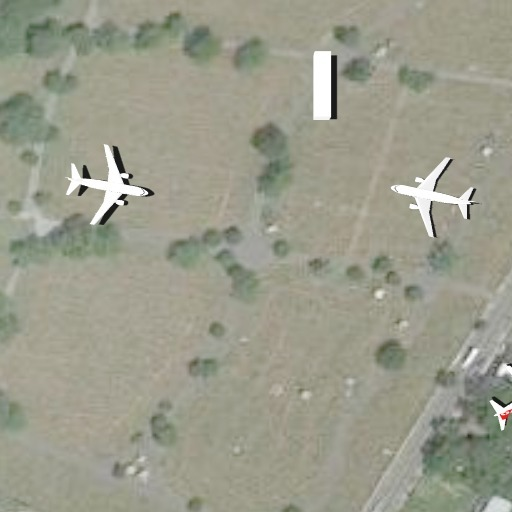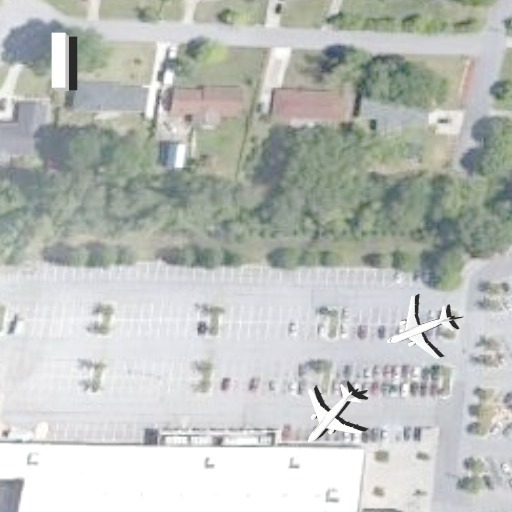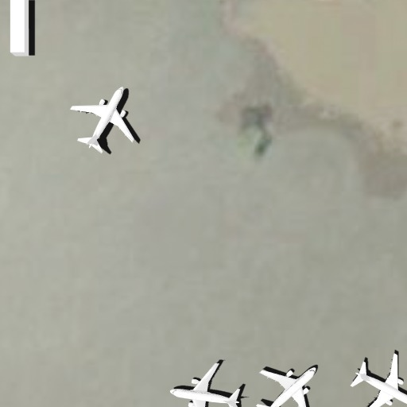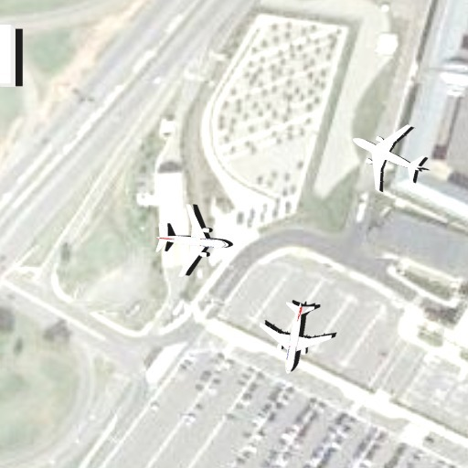

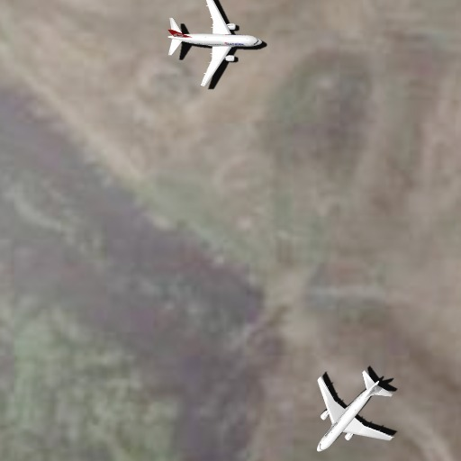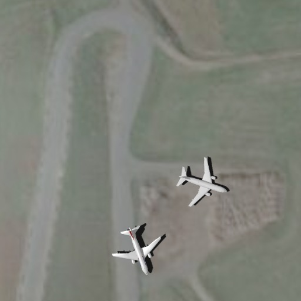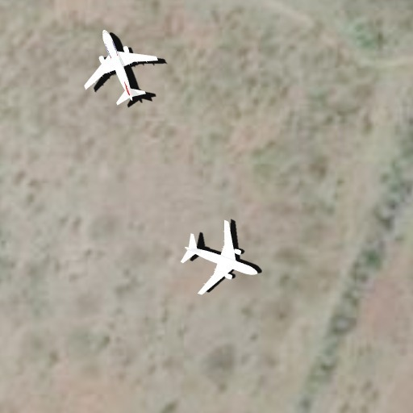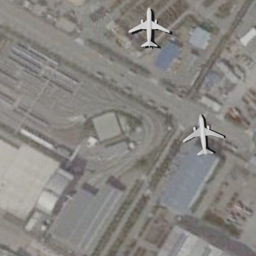

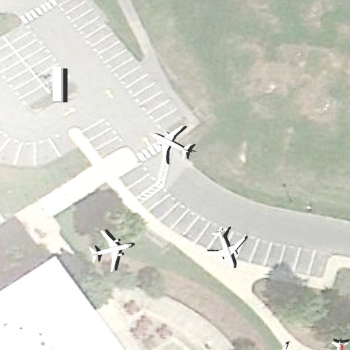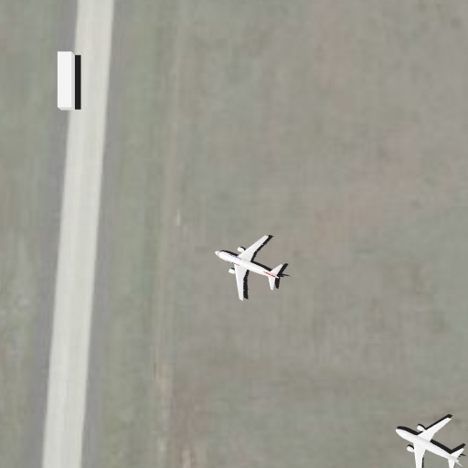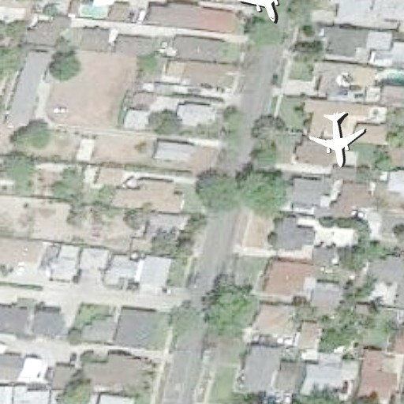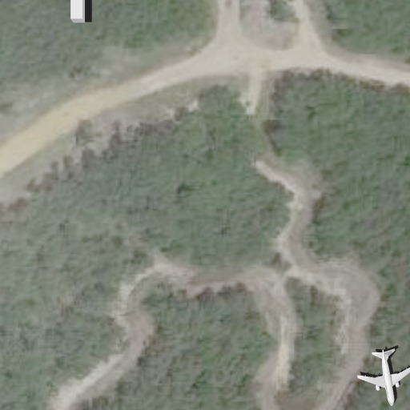

 
Weixing Liu, Jun Liu, Bin Luo 
LIESMARS, Wuhan University

